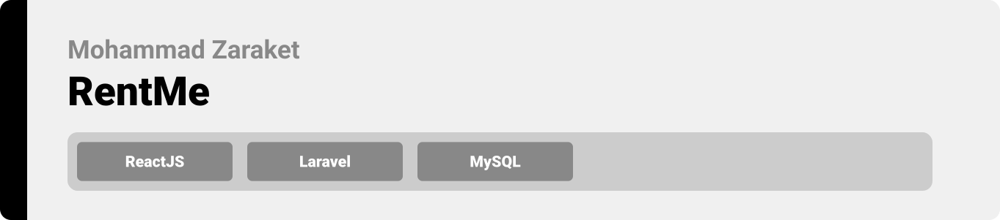
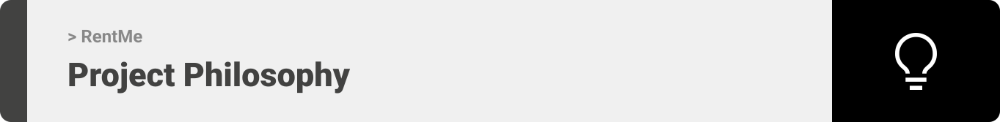
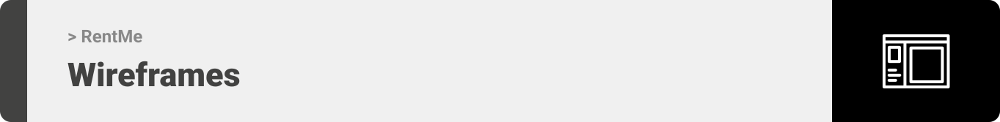
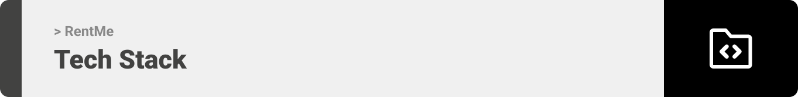
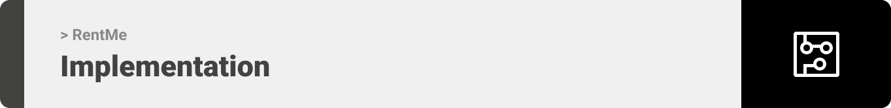
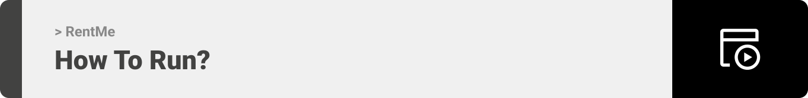

<div align="center">

> Hello world! This is the project’s summary that describes the project plain and simple, limited to the space available. 


**[PROJECT PHILOSOPHY](#project-philosophy) • [WIREFRAMES](#wireframes) • [TECH STACK](#tech-stack) • [IMPLEMENTATION](#implementation) • [HOW TO RUN?](#how-to-run)**


</div>

<br><br>




> Rent Me is a Rental Property website where users can search for nearby apartments or apartments in a specific city.
> 
> User can search either by location or by specifications of the apartment.

### User Stories

- As a user, I want to search for nearby Apartments, so that I can quickly find and check them. 
- As a user, I want to be able to search for apartments in different cities so that I won't be limited to my current location.
- As a user, I want to be able check the location of an apartment on the map.
- As a user, I want to check the availability of the apartment, so that I can request a physical tour before rent.
- As a user, I want to be able to add my own apartment and have the option to modify its details.


<br><br>



> This design was planned before on paper, then moved to Figma app for the fine details.
Note that no finished template was used, all from scratch and using pure css modules

| Main Page  |
| -----------------|
|  |

| Apartments' Results  | Apartment's Details  |
| -----------------| -----|
|  | |


<br><br>



Here's a brief high-level overview of the tech stack the Well app uses:

- This project used Laravel - the PHP web framework- as a backend to implement different APIs.
- For Frontend, the website uses React which is a JavaScript library for building user interfaces based on UI components.
- For storage, the project uses MySQL to save users and apartments data.
- The website integrates with Firebase messaging service to push notifications to users.
- The website also integrates with different geolocation services from Google maps APIs and Mapbox APIs.


<br><br>


> Using the above mentioned tech stacks and the wireframes build with figma from the user sotries we have, the implementation of the app is shown as below, these are screenshots from the real app

| Main Page  |
| -----------------|
|  | 


| Details  | Results  |
| -----------------| -----|
|  |  |


<br><br>




### Prerequisites

* npm
  ```sh
  npm install npm@latest -g
  ```

### Installation


1. Clone the repo
   ```sh
   git clone https://github.com/MohammadZaraket/RentMe.git
   ```
2. Install NPM packages
   ```sh
    npm install @material-ui/core
   ```
   ```sh
    npm install firebase
   ```
   ```sh
    npm install google-map-react
   ```
   ```sh
    npm install react-map-gl
   ```
   ```sh
    npm install --save date-fns
   ```
3. Get a free API Key at Google Maps API Services

4. Get a free public API Key at [https://mapbox.com](https://mapbox.com)

5. Enter your API in `.env`
   ```js
   const API_KEY = 'ENTER YOUR API';
   ```